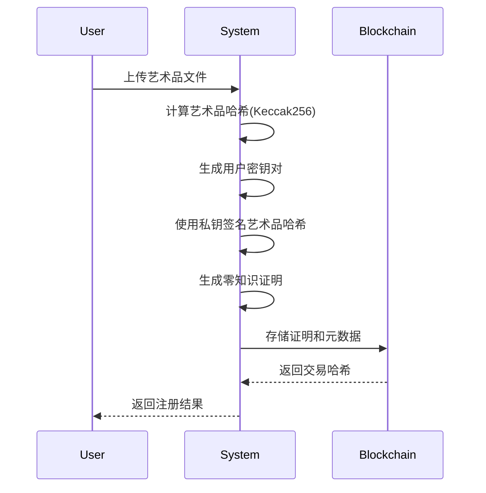
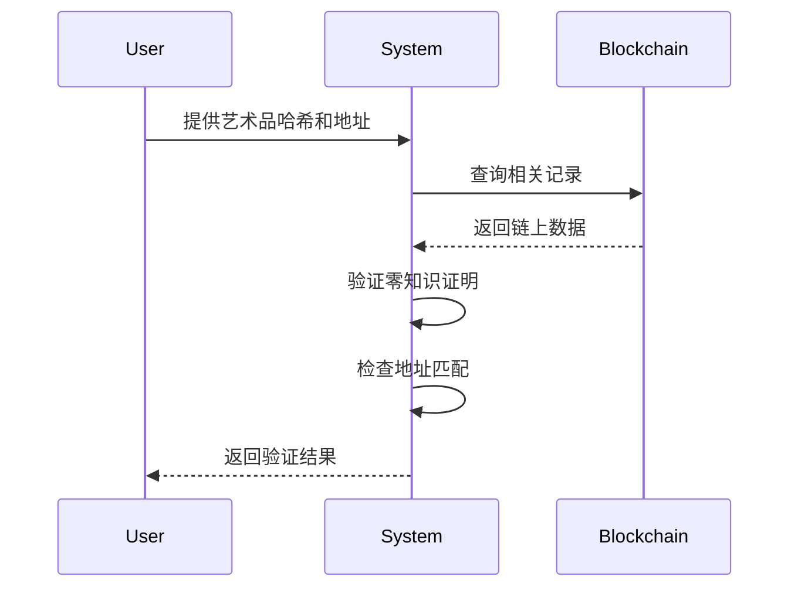
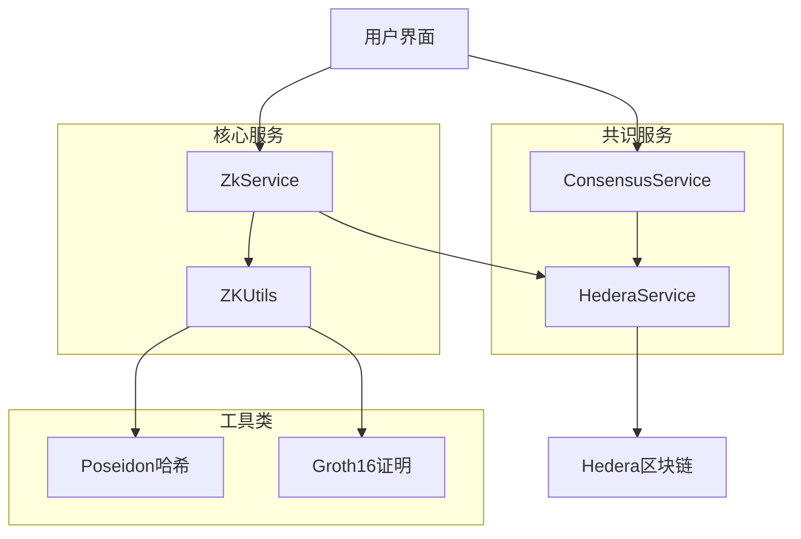

# 零知识证明在艺术品所有权验证中的应用

## 1. 数学基础

### 1.1 有限域和椭圆曲线
- 使用 BN128 椭圆曲线：$E: y^2 = x^3 + 3$
- 定义在有限域 $\mathbb{F}_p$ 上，其中 $p$ 是一个大素数
- 曲线上的点构成一个循环群 $G$

### 1.2 Poseidon 哈希函数
- 基于置换网络构建的哈希函数
- 输入：两个元素 $(x, y) \in \mathbb{F}_p^2$
- 输出：一个元素 $h \in \mathbb{F}_p$
- 数学表示：$h = \text{Poseidon}(x, y)$

### 1.3 Groth16 证明系统
- 基于 R1CS (Rank-1 Constraint System) 的零知识证明系统
- 证明者知道见证 $w$，满足 $Aw \circ Bw = Cw$
- 其中 $A, B, C$ 是约束矩阵，$\circ$ 表示逐元素乘法

## 2. 电路设计

### 2.1 所有权证明电路
```circom
template Ownership() {
    signal input sigHash;      // 签名哈希
    signal input artHash;      // 艺术品哈希
    signal output commitment;  // 承诺值

    component hash = Poseidon(2);
    hash.inputs[0] <== sigHash;
    hash.inputs[1] <== artHash;

    commitment <== hash.out;
}
```

### 2.2 电路约束
- 输入约束：$sigHash, artHash \in \mathbb{F}_p$
- 输出约束：$commitment = \text{Poseidon}(sigHash, artHash)$
- 见证：$(sigHash, artHash)$

## 3. 证明生成过程

### 3.1 输入准备
1. 艺术品数据：$data = \text{"Test Artwork #1"}$
2. 计算艺术品哈希：$artHash = \text{keccak256}(data)$
3. 生成签名：$sig = \text{sign}(artHash, sk)$
4. 从签名恢复地址：$addr = \text{recover}(sig, artHash)$

### 3.2 证明生成
1. 计算见证：$w = (sigHash, artHash)$
2. 生成证明：$\pi = (A, B, C)$
   - $A = \alpha + \sum_{i=1}^n w_i a_i$
   - $B = \beta + \sum_{i=1}^n w_i b_i$
   - $C = \gamma + \sum_{i=1}^n w_i c_i$

## 4. 实际例子分析

### 4.1 输入数据
```json
{
    "artworkData": "Test Artwork #1",
    "artworkHash": "0x3785fe7e2b81f3ab40cb173578ac0e19d60a2c9a1e1d75f3a3b1b97ead970dc8",
    "signature": "0xdb9b3e50ea70ea1d1dd7fe5ee7dc31d32497c230f8789a1ef879bc5591f2bf2c385992caf9aff08c8ac3f46f538ad116f6ffe09889aaee97220f1da70aa67ded1c",
    "ownerAddress": "0xeD2D8F4F24B11fE89D78e2caaa1d5a04FAAe9ddE"
}
```

### 4.2 证明生成
1. 将输入转换为有限域元素：
   - $sigHash = \text{field}(signature)$
   - $artHash = \text{field}(artworkHash)$

2. 计算承诺：
   - $commitment = \text{Poseidon}(sigHash, artHash)$
   - 结果：$21867235273459337049288948768937623371532292306414755940103345766722373933188$

3. 生成证明：
   - $\pi_a = [4153463000012424745480168515623158462989351670709766161804087700924827407732, ...]$
   - $\pi_b = [[17761888401940317417559402370707006931048533308902782610153993963159898372412, ...], ...]$
   - $\pi_c = [17799937086869158947344253514160077634761864245425647714291781120894983811209, ...]$

### 4.3 验证过程
1. 验证者收到：
   - 证明 $\pi$
   - 公共信号 $[commitment]$
   - 声称的所有者地址

2. 验证步骤：
   - 检查证明格式：$\pi$ 是否包含有效的 $\pi_a, \pi_b, \pi_c$
   - 验证证明：$e(\pi_a, \pi_b) = e(\pi_c, g) \cdot e(commitment, h)$
   - 检查地址：$addr == ownerAddress$

3. 验证结果：
```json
{
    "isValid": true,    // 证明有效
    "isOwner": true     // 地址匹配
}
```

## 5. 安全性和隐私性分析

### 5.1 零知识性
- 证明 $\pi$ 不泄露 $sigHash$ 和 $artHash$
- 验证者只能知道承诺值 $commitment$
- 无法从证明中恢复原始数据

### 5.2 完整性
- 只有知道正确的 $sigHash$ 和 $artHash$ 才能生成有效证明
- 伪造证明在计算上是不可行的
- 承诺值 $commitment$ 绑定到特定的输入对

### 5.3 实用性
- 证明大小固定，与输入大小无关
- 验证时间恒定，适合区块链环境
- 可以用于证明艺术品所有权而不泄露具体内容

## 6. 系统架构与实现

### 6.1 系统组件

#### 6.1.1 核心服务
- `ZkService`: 零知识证明的核心服务
  - 负责生成和验证艺术品所有权证明
  - 管理密钥对生成和存储
  - 处理文件哈希计算

#### 6.1.2 共识服务
- `HederaService`: 基于 Hedera 的区块链服务
  - 负责将证明和元数据上链存储
  - 提供链上数据查询功能
  - 支持多种主题类型（艺术品、消息等）

#### 6.1.3 工具类
- `ZKUtils`: 零知识证明工具类
  - 提供证明生成和验证的底层实现
  - 处理密钥对生成和签名验证
  - 封装 Poseidon 哈希函数调用

### 6.2 数据流程

#### 6.2.1 艺术品注册流程
1. 用户上传艺术品文件
2. 系统计算艺术品哈希（Keccak256）
3. 生成用户密钥对
4. 使用私钥对艺术品哈希签名
5. 生成零知识证明
6. 将证明和元数据上链存储

#### 6.2.2 所有权验证流程
1. 用户提供艺术品哈希和声称的所有者地址
2. 系统从链上查询相关记录
3. 验证零知识证明的有效性
4. 检查地址匹配情况
5. 返回验证结果

### 6.3 API 接口

#### 6.3.1 艺术品证明相关
```typescript
// 创建艺术品证明
POST /zk/create-artwork-proof
{
  artworkHash: string,
  signature: string
}

// 验证艺术品所有权
POST /zk/verify-artwork-ownership
{
  artworkHash: string,
  ownerAddress: string
}
```

#### 6.3.2 文件处理相关
```typescript
// 计算文件哈希
POST /consensus/calculate-image-hash
{
  file: File
}

// 获取版权信息
GET /consensus/copyright/:geoImageId
```

### 6.4 安全考虑

#### 6.4.1 密钥管理
- 私钥仅在内存中临时存储
- 使用下载令牌机制安全传递密钥
- 密钥对使用后立即从内存中清除

#### 6.4.2 文件处理
- 使用临时文件处理上传文件
- 处理完成后立即删除临时文件
- 文件内容不持久化存储

#### 6.4.3 链上存储
- 仅存储证明和哈希值
- 不存储原始艺术品数据
- 使用主题分类管理不同类型的数据

### 6.5 性能优化

#### 6.5.1 证明生成
- 使用 Groth16 证明系统，生成时间较短
- 证明大小固定，适合链上存储
- 支持批量验证

#### 6.5.2 链上查询
- 使用索引优化查询性能
- 支持按时间范围查询
- 缓存常用查询结果

#### 6.5.3 文件处理
- 使用流式处理大文件
- 并行处理多个文件
- 内存使用优化 

### 6.6 系统流程图

#### 6.6.1 艺术品注册流程


#### 6.6.2 所有权验证流程


#### 6.6.3 系统架构图


这些流程图使用 Mermaid 语法编写，可以清晰地展示：
1. 艺术品注册的完整流程
2. 所有权验证的步骤
3. 系统各组件之间的关系

流程图可以帮助读者更好地理解系统的运作方式，特别是各个组件之间的交互和数据流向。 

## 7. 技术细节详解

### 7.1 零知识证明基础概念

#### 7.1.1 什么是零知识证明？
零知识证明是一种密码学技术，它允许证明者向验证者证明某个陈述是真实的，而无需透露任何额外的信息。在我们的系统中，这用于证明某人拥有某个艺术品的所有权，而不需要透露具体的艺术品内容。

举个例子：
- 传统方式：要证明你拥有一幅画，你需要展示这幅画
- 零知识证明：你只需要提供一个证明，验证者就能确认你拥有这幅画，但看不到画的具体内容

#### 7.1.2 为什么需要零知识证明？
1. 隐私保护：保护艺术品的内容不被泄露
2. 安全性：防止伪造和篡改
3. 效率：证明大小固定，验证速度快

### 7.2 核心密码学组件

#### 7.2.1 哈希函数
哈希函数是一种将任意长度的输入转换为固定长度输出的函数。在我们的系统中使用了两种哈希函数：

1. Keccak256（以太坊使用的哈希函数）
   - 输入：艺术品文件
   - 输出：256位的哈希值
   - 特点：抗碰撞性强，计算速度快

2. Poseidon（零知识证明专用哈希函数）
   - 输入：签名和艺术品哈希
   - 输出：有限域中的元素
   - 特点：适合零知识证明电路，计算效率高

#### 7.2.2 椭圆曲线密码学
我们使用 BN128 椭圆曲线，这是一种特殊的数学曲线，具有以下特性：
- 曲线方程：y² = x³ + 3
- 定义在有限域上
- 支持高效的密码学操作

椭圆曲线上的点可以用于：
- 生成密钥对
- 进行数字签名
- 实现零知识证明

### 7.3 证明系统详解

#### 7.3.1 Groth16 证明系统
Groth16 是一种高效的零知识证明系统，它的工作流程如下：

1. 电路编译
   ```circom
   // 所有权证明电路
   template Ownership() {
       signal input sigHash;      // 签名哈希
       signal input artHash;      // 艺术品哈希
       signal output commitment;  // 承诺值
       
       // 使用 Poseidon 哈希函数
       component hash = Poseidon(2);
       hash.inputs[0] <== sigHash;
       hash.inputs[1] <== artHash;
       
       commitment <== hash.out;
   }
   ```

2. 证明生成
   - 输入：签名哈希和艺术品哈希
   - 输出：证明 π = (A, B, C)
   - 过程：使用见证（witness）生成证明

3. 证明验证
   - 输入：证明 π 和公共信号
   - 输出：验证结果（true/false）
   - 过程：检查配对等式是否成立

#### 7.3.2 证明生成过程
让我们通过一个具体例子来说明：

1. 输入准备
   ```typescript
   // 艺术品数据
   const artworkData = "Test Artwork #1";
   
   // 计算哈希
   const artworkHash = ethers.keccak256(
     ethers.toUtf8Bytes(artworkData)
   );
   
   // 生成签名
   const signature = await wallet.signMessage(artworkHash);
   ```

2. 电路输入
   ```typescript
   const input = {
     sigHash: signature,    // 签名哈希
     artHash: artworkHash   // 艺术品哈希
   };
   ```

3. 生成证明
   ```typescript
   const { proof, publicSignals } = await ZKUtils.generateZKProof(input);
   ```

### 7.4 链上存储机制

#### 7.4.1 数据结构
```typescript
interface ArtworkRecord {
  proof: any;          // 零知识证明
  publicSignals: any[]; // 公共信号
  artworkHash: string;  // 艺术品哈希
  pubKeyHash: string;   // 公钥哈希
  timestamp: number;    // 时间戳
}
```

#### 7.4.2 存储流程
1. 数据准备
   - 生成证明
   - 准备元数据
   - 计算时间戳

2. 上链存储
   ```typescript
   await hederaService.submitToChain(TopicType.ARTWORK, {
     proof,
     publicSignals,
     artworkHash,
     pubKeyHash: ownerAddress
   });
   ```

3. 查询验证
   ```typescript
   const record = await hederaService.findRecord(TopicType.ARTWORK, {
     artworkHash
   });
   ```

### 7.5 安全机制详解

#### 7.5.1 密钥管理
1. 密钥生成
   ```typescript
   const wallet = ethers.Wallet.createRandom();
   const keyPair = {
     address: wallet.address,
     publicKey: wallet.publicKey,
     privateKey: wallet.privateKey
   };
   ```

2. 安全存储
   - 私钥仅在内存中临时存储
   - 使用后立即清除
   - 通过下载令牌机制传递

#### 7.5.2 文件处理安全
1. 临时文件处理
   ```typescript
   // 创建临时文件
   const tempFilePath = path.join(os.tmpdir(), file.originalname);
   
   // 写入文件
   await fs.promises.writeFile(tempFilePath, file.buffer);
   
   // 处理完成后删除
   await fs.promises.unlink(tempFilePath);
   ```

2. 内存管理
   - 使用流式处理
   - 及时释放内存
   - 避免内存泄漏

### 7.6 性能优化策略

#### 7.6.1 证明生成优化
1. 电路优化
   - 最小化约束数量
   - 优化哈希函数选择
   - 减少公共输入数量

2. 并行处理
   ```typescript
   // 使用 Promise.all 并行处理多个证明
   const proofs = await Promise.all(
     artworks.map(artwork => generateProof(artwork))
   );
   ```

#### 7.6.2 链上查询优化
1. 索引优化
   - 按时间范围索引
   - 按哈希值索引
   - 按地址索引

2. 缓存策略
   ```typescript
   // 使用内存缓存
   const cache = new Map();
   
   // 缓存查询结果
   const getCachedRecord = async (hash) => {
     if (cache.has(hash)) {
       return cache.get(hash);
     }
     const record = await queryRecord(hash);
     cache.set(hash, record);
     return record;
   };
   ``` 